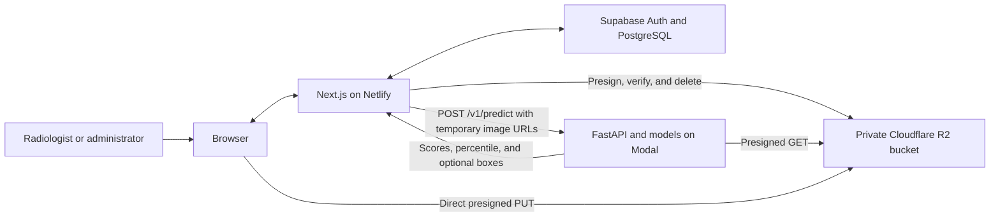
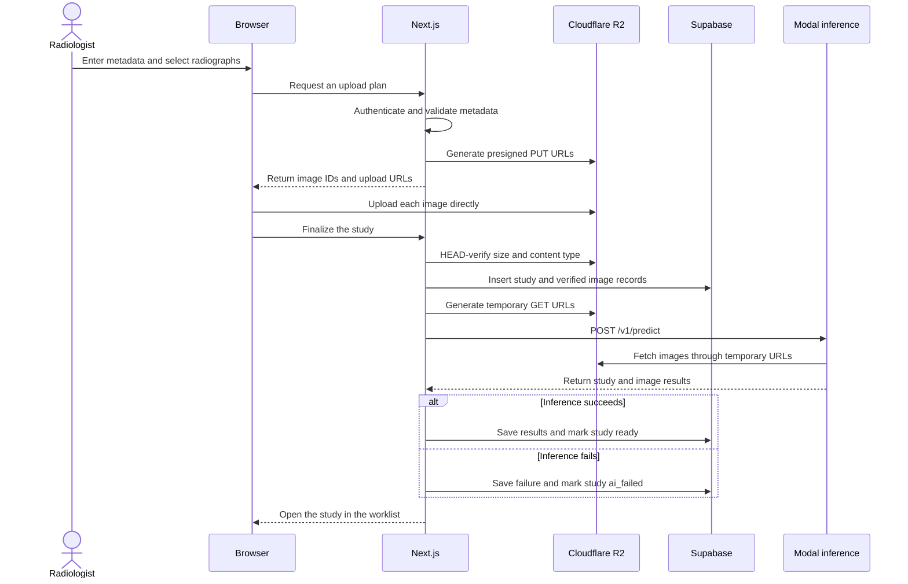

<div align="center">
  

  # PHYSIS

  Pediatric wrist radiograph triage for a radiologist's reading queue.

  [Live application](https://physis-fracture.netlify.app/) | [AI backend and research](https://github.com/physis-fracture/OsteoJEPA)
</div>

### email & Password  
- admin@gmail.com
- Password123

## About the project

PHYSIS is a research and competition prototype that helps radiologists decide which pediatric wrist study to review next. It accepts one or more radiographs, sends them to an inference service, and orders the worklist by the returned age-band-relative priority percentile.

PHYSIS is a triage aid. It does not diagnose fractures, replace radiologist interpretation, or provide treatment recommendations. A priority percentile describes a study's relative position in its reference age band. It is not a probability that the patient has a fracture.

## What is implemented

- Internal authentication through Supabase Auth, with radiologist and administrator roles
- An operational dashboard for pending, high-priority, reviewed, failed, and unscored studies
- Multi-image study submission with age, sex, projection, and laterality metadata
- Direct browser uploads to a private Cloudflare R2 bucket through presigned URLs
- Server-side upload verification before database records or inference requests are created
- AI inference through a bearer-authenticated FastAPI service deployed on Modal
- A server-filtered and paginated worklist ordered by priority percentile and waiting time
- A case page with the original radiograph, optional model bounding boxes, study scores, and per-image results
- Radiologist review with fracture, no-fracture, and uncertain outcomes
- Operational analytics and administrator pages for users and service status
- A PACS configuration screen for demonstration only; it does not provide production DICOM or PACS connectivity

## System architecture

The frontend uses the Next.js App Router and runs on Netlify. Next.js owns application rules and coordinates three external services: Supabase for identity and relational data, Cloudflare R2 for private radiograph objects, and the Modal-hosted FastAPI service for inference.



### Responsibility boundaries

| Component | Responsibility |
| --- | --- |
| Browser | Collect study metadata, upload files directly to R2, and render the application |
| Next.js | Authenticate users, authorize actions, validate input, sign R2 requests, call inference, persist results, and render server components |
| Supabase | Store users, profiles, studies, image metadata, AI results, reviews, and audit events |
| Cloudflare R2 | Store original radiograph files in a private bucket |
| Modal and FastAPI | Fetch temporary image URLs, preprocess images, run the models, and return inference results |

The inference service has no Supabase access and receives no R2 credentials. It can read an image only through the temporary URL supplied with an authenticated prediction request.

## Study and inference flow



The database insert happens only after R2 confirms each uploaded object's size and content type. If inference fails, the study and its images remain available. The worklist exposes the failure and places unscored studies after scored studies, ordered by arrival time within that group.

## AI service

The web application sends patient age, sex, projection, laterality, and short-lived image URLs to `POST /v1/predict`. The current contract returns image scores, a study score computed as the maximum image score, an age-band-relative priority percentile, valid patch fractions, model provenance, latency, and optional bounding boxes.

Model training, methodology, evaluation results, dataset details, serving code, and known limitations live in the [OsteoJEPA repository](https://github.com/physis-fracture/OsteoJEPA). That repository also documents the original age-conditioned JEPA experiment and the supervised models used by the current inference service.

## Application routes

| Route | Access | Purpose |
| --- | --- | --- |
| `/login` | Public | Internal account sign-in |
| `/dashboard` | Authenticated | Operational overview and recent studies |
| `/studies/new` | Authenticated | Manual study ingestion |
| `/worklist` | Authenticated | Searchable and prioritized reading queue |
| `/worklist/[studyId]` | Authenticated | Radiograph review, AI result, and human adjudication |
| `/analytics` | Authenticated | Operational, inference, age, and review metrics |
| `/admin/users` | Administrator | User provisioning, roles, and account state |
| `/admin/system` | Administrator | Inference health and system information |
| `/admin/pacs` | Administrator | Non-production PACS configuration demonstration |

There is no public registration route. Administrators provision accounts through a protected server action.

## Technology stack

| Area | Technology |
| --- | --- |
| Application | Next.js App Router, React 19, TypeScript |
| Interface | Tailwind CSS 4, shadcn/ui, Lucide, Recharts |
| Validation | Zod |
| Authentication and data | Supabase Auth, PostgreSQL, Row Level Security |
| Object storage | Cloudflare R2 through the AWS S3 SDK |
| AI integration | FastAPI on Modal through a typed server-only client |
| Hosting | Netlify with `@netlify/plugin-nextjs` |
| Testing | Vitest and ESLint |

## Repository structure

```text
app/
├── (auth)/              login flow
├── (app)/               authenticated routes and layouts
└── auth/                email confirmation and auth error routes

features/
├── admin/               user and system administration
├── analytics/           operational metrics and charts
├── auth/                session and login behavior
├── case-detail/         radiograph viewer, AI summary, and review
├── dashboard/           operational overview
├── studies/             validation, upload, and inference orchestration
└── worklist/            queue filters, sorting, pagination, and deletion

components/
├── shared/              cross-feature application components
└── ui/                  shadcn/ui primitives

lib/
├── inference/           API contract and server-only FastAPI client
├── r2/                  object keys, presigned URLs, verification, and deletion
└── supabase/            browser, server, admin, and session clients

docs/                    product, design, architecture, and infrastructure rules
openapi.json             inference service contract snapshot
netlify.toml             production build configuration
```

Business logic stays inside its owning feature. Shared interface primitives live in `components/`, while external service clients remain in `lib/`.

## Running locally

### Prerequisites

- Node.js 22
- pnpm
- A provisioned Supabase project
- A private Cloudflare R2 bucket
- A running PHYSIS inference service or deployed Modal endpoint

This repository contains generated Supabase types but does not contain database migrations or demo seeds. Local development requires a Supabase project with the tables, enums, views, functions, and RLS policies represented by `lib/supabase/database.types.ts`.

### 1. Clone and install

```bash
git clone https://github.com/physis-fracture/physis-website.git
cd physis-website
pnpm install
```

### 2. Configure the environment

Create a local environment file from the tracked example:

```bash
cp .env.example .env.local
```

Fill in every value in `.env.local`. The required variables and their visibility are listed in the next section.

### 3. Prepare the services

Before starting Next.js, make sure that:

- Supabase has the schema represented by `lib/supabase/database.types.ts`.
- Supabase Auth contains an active user with a matching row in `profiles`.
- The R2 bucket exists and accepts uploads from `http://localhost:3000`.
- `PHYSIS_INFERENCE_BASE_URL` points to a running local or Modal-hosted inference service.

The AI backend repository contains its own setup and serving instructions: [OsteoJEPA inference service](https://github.com/physis-fracture/OsteoJEPA#the-inference-service).

### 4. Start the application

```bash
pnpm dev
```

Open [http://localhost:3000](http://localhost:3000) and sign in with the active Supabase account prepared above. Unauthenticated visitors are redirected to `/login`.

To test the optimized production server locally:

```bash
pnpm build
pnpm start
```

## Environment variables

| Variable | Visibility | Purpose |
| --- | --- | --- |
| `NEXT_PUBLIC_SUPABASE_URL` | Browser and server | Supabase project URL |
| `NEXT_PUBLIC_SUPABASE_PUBLISHABLE_KEY` | Browser and server | Supabase publishable or anonymous key |
| `SUPABASE_SERVICE_ROLE_KEY` | Server only | Protected administrative user and AI-result operations |
| `R2_ACCOUNT_ID` | Server only | Cloudflare account identifier |
| `R2_ACCESS_KEY_ID` | Server only | R2 API token access key |
| `R2_SECRET_ACCESS_KEY` | Server only | R2 API token secret |
| `R2_BUCKET_NAME` | Server only | Private bucket name, normally `physis` |
| `R2_ENDPOINT` | Server only | S3-compatible R2 endpoint |
| `PHYSIS_INFERENCE_BASE_URL` | Server only | FastAPI service base URL |
| `PHYSIS_INFERENCE_API_KEY` | Server only | Bearer token for prediction requests |

Copy `.env.example` to `.env.local` and replace every placeholder. Never add `NEXT_PUBLIC_` to R2, service-role, or inference credentials.

## Cloudflare R2 setup

1. Create a private bucket named `physis`, or set `R2_BUCKET_NAME` to the bucket you use.
2. Create an R2 API token with Object Read and Write access limited to that bucket.
3. Set `R2_ENDPOINT` to `https://<ACCOUNT_ID>.r2.cloudflarestorage.com`.
4. Apply a CORS policy that permits the local and deployed frontend origins.

```json
[
  {
    "AllowedOrigins": [
      "http://localhost:3000",
      "https://physis-fracture.netlify.app"
    ],
    "AllowedMethods": ["PUT", "GET", "HEAD"],
    "AllowedHeaders": ["Content-Type"],
    "ExposeHeaders": ["ETag"],
    "MaxAgeSeconds": 3600
  }
]
```

Supported uploads are PNG, JPEG, TIFF, BMP, WebP, and GIF files up to 32 MB each. Object keys use generated study and image UUIDs:

```text
studies/{study_uuid}/images/{image_uuid}/original.{extension}
```

Patient names, email addresses, and other direct identifiers must not appear in object keys.

## Available commands

```bash
pnpm dev       # start the development server
pnpm build     # create a production build
pnpm start     # run the production server
pnpm lint      # run ESLint
pnpm test      # run the Vitest suite
```

## Security and failure behavior

- Supabase sessions protect application routes, and active-profile checks prevent disabled accounts from entering the app.
- Administrator actions verify roles on the server. The service-role key is never imported into client components.
- R2 stays private. The application stores object keys, not presigned URLs.
- Upload URLs and viewing URLs expire after about ten minutes.
- Uploaded objects are verified with a HEAD request before their metadata is inserted.
- Inference requests have a 120-second timeout and do not retry automatically because a retry could duplicate expensive GPU work.
- The inference client validates success and error responses with Zod and removes URLs from surfaced error messages.
- Failed inference is recorded explicitly. The study remains in the worklist instead of disappearing or receiving a misleading low score.
- AI results and radiologist reviews are stored separately so a human review cannot overwrite the original model output.

Use de-identified or public radiographs for demonstrations. Do not place real patient identifiers in study codes, object keys, logs, or screenshots.

## Deployment

The production frontend is available at [physis-fracture.netlify.app](https://physis-fracture.netlify.app/). Netlify runs `pnpm run build`, publishes the Next.js output, and uses `@netlify/plugin-nextjs` for App Router support.

Configure the same environment variables in Netlify and allow the production domain in the R2 CORS policy. The AI service is deployed separately from the web application. Deployment instructions for that service are maintained in the [AI repository](https://github.com/physis-fracture/OsteoJEPA#the-inference-service).
