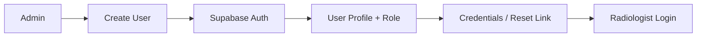
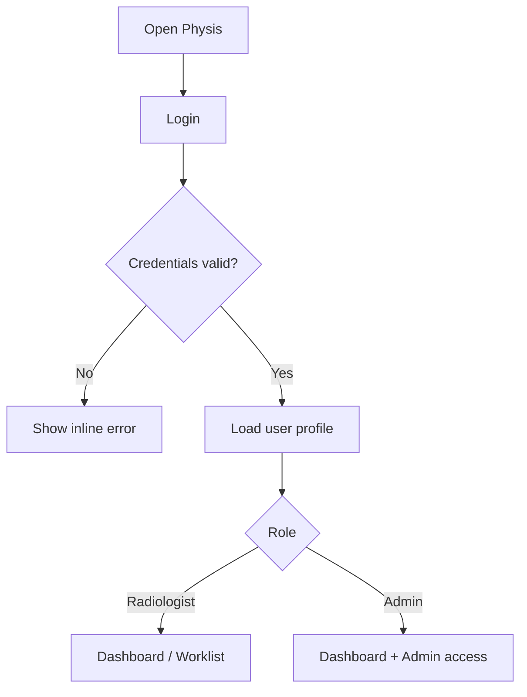
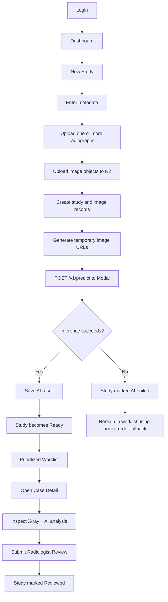
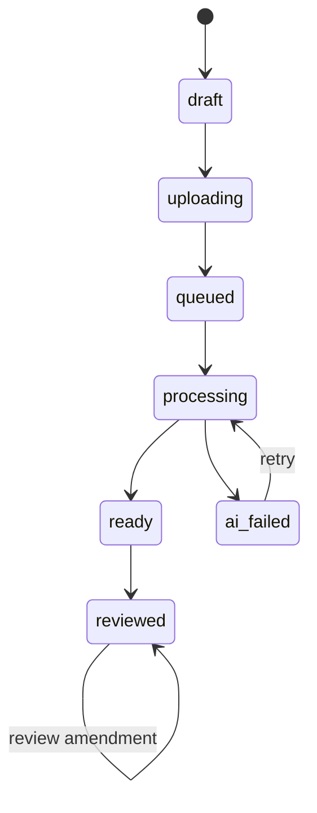
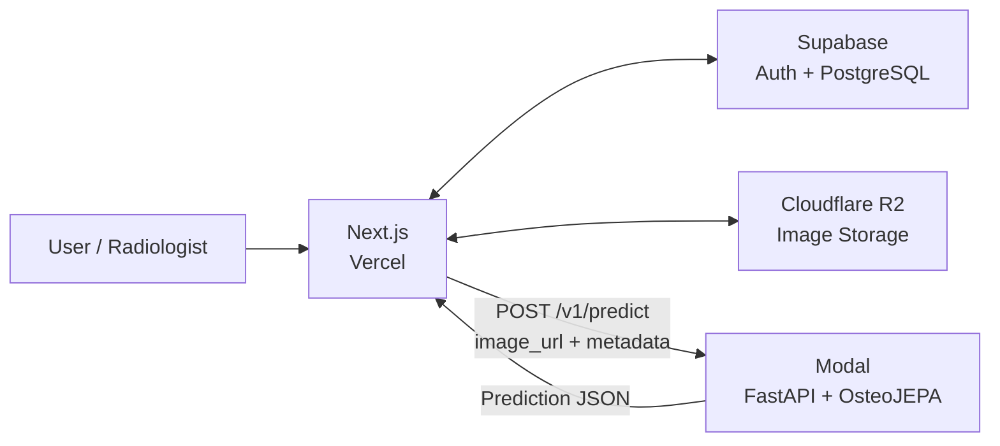
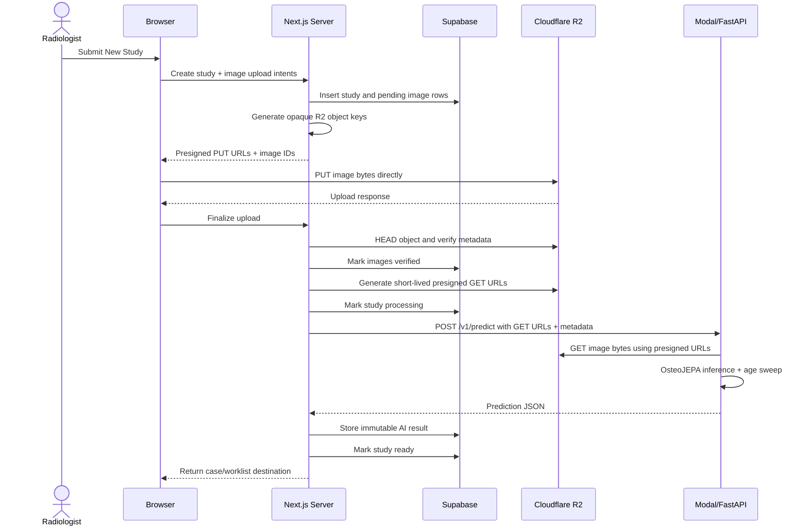
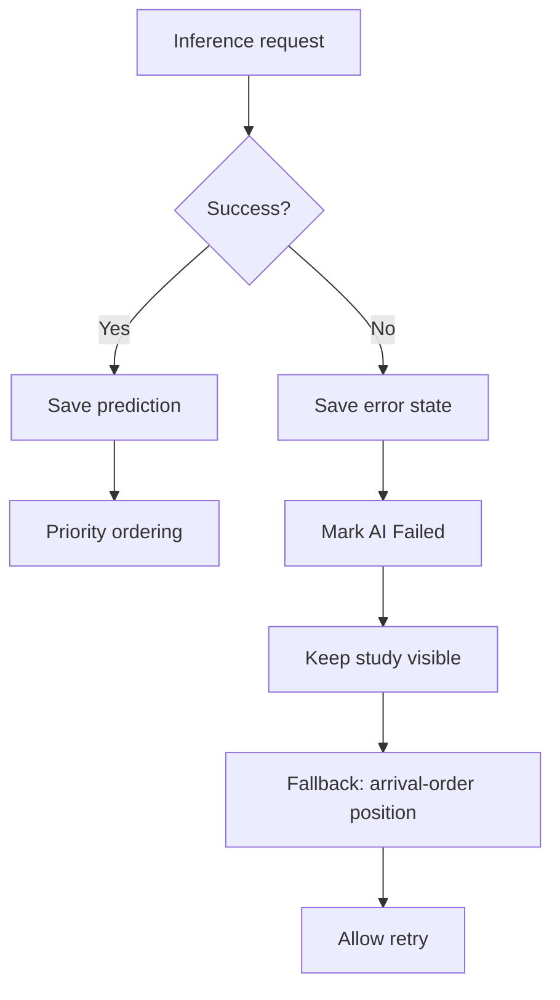
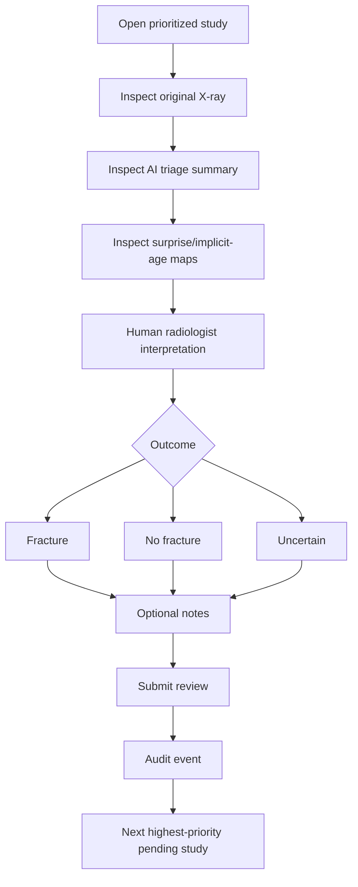

# PHYSIS — Product Requirements Document (PRD)

**Product:** Physis  
**Document:** Product Requirements Document  
**Status:** Semifinal MVP / Competition Build  
**Primary user:** Radiologist  
**Secondary user:** Hospital/System Administrator  
**Product class:** Computer-aided radiology triage and notification prototype  
**Primary modality:** Pediatric wrist radiographs  
**AI:** OsteoJEPA with age-conditioned predictive representation and age-attribution gap  
**Frontend:** Next.js + Tailwind CSS + shadcn/ui  
**Backend / App orchestration:** Next.js server layer  
**Database/Auth:** Supabase Auth + PostgreSQL  
**Object storage:** Cloudflare R2  
**AI inference:** Modal + FastAPI + OsteoJEPA  
**Deployment:** Vercel + Supabase + Cloudflare R2 + Modal

---

# 1. Executive Summary

Physis is a pediatric radiograph triage system designed to reprioritize the radiologist worklist so studies with higher model-derived abnormality scores are reviewed earlier.

Physis does **not** make a clinical diagnosis and must not present itself as a replacement for a radiologist. The core product behavior is worklist prioritization.

The product is based on an age-conditioned predictive representation approach. Instead of treating pediatric normal anatomy as one static class, OsteoJEPA models normal anatomy as a trajectory conditioned on age. During inference, the model performs an age sweep and derives:

- a normalized surprise map;
- an implicit-age map;
- image-level triage score;
- study-level triage score;
- age-relative priority percentile.

The competition MVP must demonstrate the complete user journey:

**study ingestion -> AI processing -> prioritized worklist -> radiologist case review -> adjudication -> operational analytics**

The product should be visually and operationally simpler than large commercial radiology suites. It should focus on the specific triage workflow claimed in the paper rather than attempting to reproduce PACS, RIS, EMR, reporting, or hospital-management systems.

---

# 2. Product Thesis

## 2.1 Problem

In settings where radiographs may initially be interpreted by an on-duty non-radiologist and only reviewed by a radiologist later, radiology queues may operate in arrival order.

For pediatric trauma, that creates additional risk because developmental anatomy changes continuously with age, and subtle fractures around growth structures can be difficult to distinguish from normal anatomy.

The product problem is therefore:

> How can radiologist adjudication be reordered so pediatric radiographs that appear most abnormal relative to normal anatomy for the patient's age are reviewed earlier?

## 2.2 Product Answer

Physis assigns a study-level triage score and age-relative priority percentile, then reorders the radiologist worklist.

Before opening a case, the radiologist sees:

- queue position;
- priority percentile;
- triage score;
- waiting time;
- basic study metadata.

After opening a case, the radiologist can additionally inspect:

- original radiograph;
- normalized surprise map;
- implicit-age map;
- implicit-age summary/deviation;
- image-level score for each projection.

The on-duty doctor does not receive model output before making the initial clinical decision.

---

# 3. Product Goals

## 3.1 Primary Goals

1. Demonstrate a complete and testable AI-assisted radiology triage workflow.
2. Prioritize studies using the study-level Physis triage score.
3. Make AI output understandable without overstating diagnostic certainty.
4. Preserve the scientific mechanism described in the paper.
5. Provide a credible pathway from competition prototype to hospital integration.
6. Provide strong system reliability, error handling, auditability, and reproducibility.
7. Make the core workflow fast and low-friction for a radiologist.

## 3.2 Competition Goals

The implementation should visibly support the competition rubric:

- Value Creation & Demonstrated Impact
- Adoption, Feasibility & Scalability
- Innovation & Meaningful Differentiation
- Functional Product & User Experience
- AI Implementation & Technical Excellence
- Evaluation, Reliability & Responsible AI
- System Design, Engineering & Reproducibility
- Product Demonstration & Presentability

## 3.3 Non-Goals

The semifinal MVP will not attempt to build:

- a full PACS;
- a full RIS;
- SIMRS/HIS;
- EMR/RME;
- automated clinical diagnosis;
- automated treatment recommendation;
- fracture bounding-box diagnosis as the core product;
- medical report generation;
- patient portal;
- appointment scheduling;
- billing;
- insurance workflows;
- public patient registration;
- production DICOM C-STORE integration;
- production on-premise deployment;
- production site-specific fine-tuning.

DICOM C-STORE, on-premise packaging, site adapters, and periodic fine-tuning remain roadmap items unless separately implemented and tested.

---

# 4. Product Positioning

## 4.1 Category

Radiology AI triage / computer-aided triage and notification.

## 4.2 Primary Buyer

Hospital / radiology department.

## 4.3 Primary User

Radiologist responsible for reviewing pediatric trauma radiographs.

## 4.4 Secondary User

Hospital/system administrator responsible for:

- account provisioning;
- system configuration;
- monitoring service health;
- viewing operational usage.

## 4.5 Upstream Stakeholder

On-duty physician / emergency physician.

The MVP does not need a dedicated on-duty physician dashboard because the paper explicitly preserves an independent initial human decision before AI output is shown.

---

# 5. Competitive Positioning

Commercial fracture AI systems already provide combinations of:

- fracture detection;
- localization;
- worklist prioritization;
- PACS integration;
- structured/pre-filled reports;
- support for multiple skeletal regions;
- pediatric and adult populations.

Physis should **not** claim superiority in deployment maturity, clinical evidence, anatomical coverage, regulatory status, integration breadth, or diagnostic accuracy.

The credible differentiation to demonstrate is:

1. **Age-conditioned normative representation**  
   Normal pediatric anatomy is modeled as age-dependent.

2. **Interventional age sweep at inference**  
   Age is varied during inference to measure how well abnormal appearance can be explained by another developmental stage.

3. **Age-attribution gap**  
   The system distinguishes high residual that may be explained by age from high residual that remains unexplained.

4. **Normal-image learning regime**  
   The core approach is designed around clean normal radiographs rather than requiring fracture labels for the main triage score.

5. **Potential lower-friction local recalibration**  
   The paper proposes recalibration using normal local images and age-band statistics. This must be presented as a hypothesis/roadmap until validated experimentally.

6. **Focused triage UX**  
   Physis should remain a lightweight prioritization tool rather than becoming a general-purpose diagnostic suite.

---

# 6. Product Principles

## 6.1 Triage First

The worklist is the primary product surface.

The product should answer:

> Which case should the radiologist open next?

## 6.2 AI Should Not Pretend to Diagnose

Use language such as:

- Priority percentile
- Triage score
- Higher-than-normal surprise
- Age-relative deviation
- AI triage analysis

Avoid unvalidated language such as:

- "Fracture detected"
- "Patient has fracture"
- "Diagnosis"
- "Guaranteed normal"
- "AI confidence of fracture"

unless a separately validated detector is explicitly being shown as an experimental baseline.

## 6.3 Progressive Disclosure

Worklist:
- priority and score only;
- no localization.

Case detail:
- richer AI explanation;
- surprise map;
- implicit age information.

This directly follows the paper's receiver-specific output design.

## 6.4 Human Remains in Control

Radiologist review/adjudication is the final user action.

## 6.5 Failure-Safe

If AI inference fails:

- the study must remain accessible;
- the study must not disappear;
- the system must expose the failure state;
- queue ordering can fall back to arrival time.

## 6.6 No Fake Clinical Evidence

No fabricated:
- performance numbers;
- hospital adoption;
- wait-time reduction;
- accuracy;
- calibration quality;
- clinical outcome.

Only actual experiment results may be shown as evidence.

---

# 7. Information Architecture

```text
Physis
├── Login
├── Dashboard
├── Worklist
├── New Study
├── Case Detail
│   └── Radiologist Review
├── Analytics
└── Admin
    ├── Users
    └── System & Model
```

`Case Detail` and `Radiologist Review` are contextual routes and do not need to be permanent sidebar entries.

---

# 8. Route Structure

```text
/login
/forgot-password
/reset-password

/dashboard

/studies/new

/worklist
/worklist/[studyId]

/analytics

/admin/users
/admin/system
```

No public:

```text
/register
/signup
```

---

# 9. Roles and Permissions

## 9.1 Radiologist

Can:

- log in;
- view dashboard;
- view prioritized worklist;
- create/upload a study in the competition prototype;
- open study details;
- inspect AI results;
- submit radiologist review;
- view relevant analytics.

Cannot:

- create users;
- change user roles;
- access service credentials;
- change model configuration;
- alter stored AI predictions.

## 9.2 Admin

Can:

- perform all operational user management;
- create/disable users;
- assign roles;
- inspect model/service status;
- inspect operational logs/health metadata;
- view analytics.

Admin should not have direct access to secrets or raw service credentials through the UI.

---

# 10. Authentication Flow

## 10.1 Account Provisioning



## 10.2 Login



---

# 11. Core User Journey



---

# 12. Page Requirements

# 12.1 Login

## Purpose

Secure internal application entry point.

## Components

- Physis logo/name
- email
- password
- Sign In
- Forgot Password
- validation/error message

## UX Rules

- No marketing hero.
- No public sign-up.
- No role selector.
- Do not expose whether a specific account exists.
- Redirect authenticated users away from `/login`.
- Preserve intended destination when session expires.

---

# 12.2 Dashboard

## Purpose

Provide a fast operational overview, not a decorative analytics homepage.

## Primary Metrics

- Pending Studies
- High-Priority Studies
- Reviewed Today
- AI Processing / Failed
- Median or Average Waiting Time, only if calculated from real application data

## Secondary Content

- priority distribution;
- recent high-priority studies;
- oldest pending studies;
- inference service status.

## Primary CTA

`New Study`

## Secondary CTA

`Open Worklist`

## UX Rules

- Maximum 4-5 top-level metric cards.
- No giant hero.
- No unnecessary charts.
- Clicking a metric applies the equivalent Worklist filter.
- Metrics should be derived from database data, not mocked after the demo dataset has been loaded.

---

# 12.3 New Study

## Purpose

Prototype ingestion surface that simulates the study entering from a radiology acquisition workflow.

In production, this route is expected to be replaced or supplemented by PACS/DICOM ingestion.

## Study Fields

| Field | Required | Notes |
|---|---|---|
| Study ID | Yes | Unique internal study identifier |
| Patient reference | Optional | De-identified reference only for demo |
| Age | Yes | Numeric, supported model range |
| Sex | Yes | `male`, `female`, `unknown` |
| Notes | No | Operational note only, not diagnosis |

## Image Fields

Each study supports one or more images.

| Field | Required | Notes |
|---|---|---|
| Image file | Yes | Supported radiograph format |
| View | Yes | `PA`, `AP`, `LATERAL`, `OTHER`, `UNKNOWN` |
| Laterality | Yes | `left`, `right`, `unknown` |

## Actions

- Add Image
- Remove Image
- Run Physis Analysis

## UX Requirements

- Study metadata appears first.
- Image input is repeatable.
- Show filename and preview.
- Validate before upload.
- Disable duplicate submit while processing.
- Show upload and inference stages separately.
- Do not ask users for model-specific parameters.
- Do not ask users for priority or score.

## Processing States

```text
Draft
Uploading
Queued
Processing
Ready
AI Failed
```

---

# 12.4 Worklist

## Purpose

Primary radiologist workspace.

## Default Behavior

Default sorting:

1. highest valid priority percentile;
2. longest waiting time as tie breaker.

Studies without valid AI result use fallback ordering by arrival time.

## Required Columns

| Column | Purpose |
|---|---|
| Priority | Fast visual state |
| Study ID | Primary identifier |
| Age | Critical model context |
| Sex | Study metadata |
| Views | PA/AP/Lateral/etc |
| Waiting Time | Workflow urgency |
| Priority Percentile | Main interpretable AI queue metric |
| Triage Score | Raw/model score if useful |
| Status | Pending/Reviewed/AI Failed/etc |
| Updated | Recency |

## Recommended Priority Presentation

Priority categories are application-level presentation rules derived from percentile thresholds.

They are **not scientific diagnoses** and must be documented as configurable UI thresholds.

Example:

```text
Critical  -> >= configured critical percentile
High      -> >= configured high percentile
Standard  -> remaining valid scores
Unscored  -> AI unavailable or failed
```

Do not hardcode these thresholds into scientific claims.

## Filters

- search Study ID / patient reference;
- status;
- priority;
- age range;
- sex;
- view;
- date;
- AI state.

## URL Query Parameters

All table state must be encoded in query parameters.

Example:

```text
/worklist?q=ST-1041&status=pending&priority=high&page=2&sort=priority_desc
```

This includes:

- search;
- filters;
- sorting;
- pagination.

Refresh/back/forward/share must preserve the worklist state.

## UX Rules

- Desktop-first.
- Use a dense table, not card grid.
- Sticky table header.
- Row selection navigates to case.
- Avoid color-only priority indication.
- Priority label + percentile remain visible.
- No surprise map/localization in the worklist.
- Loading uses table skeletons.
- Empty states explain why no studies match.
- AI failure state remains visible and actionable.

---

# 12.5 Case Detail

## Purpose

Allow radiologist to inspect the original radiograph and the model outputs defined by the paper.

## Layout

Desktop:

```text
┌────────────────────────────────────────────────────┐
│ Breadcrumb / Study / Status / Waiting Time         │
├───────────────────────────────┬────────────────────┤
│                               │ Study Metadata     │
│                               │                    │
│       X-ray Viewer            │ AI Triage Summary  │
│                               │                    │
│                               │ Review Panel       │
├───────────────────────────────┴────────────────────┤
│ Image selector / projection tabs                   │
└────────────────────────────────────────────────────┘
```

Recommended approximate split:

```text
65-72% image workspace
28-35% information panel
```

The radiograph is the dominant visual element.

## Header

- Study ID
- age
- sex
- study status
- waiting time
- back to worklist

## X-ray Viewer

Minimum:

- original image;
- fit-to-screen;
- zoom;
- pan;
- reset;
- image/projection switcher.

Optional if time permits:

- window/level-like brightness and contrast controls for demo imagery.

Do not implement clinical-grade viewer claims unless actually validated.

## AI Triage Summary

Show:

- Study Priority Percentile
- Study Triage Score
- Age Band
- Recorded Age
- Implicit Age summary
- Implicit Age Gap
- Inference Time
- Model Version

## AI Visualization

Tabs or segmented controls:

```text
Original
Surprise Map
Implicit Age Map
Overlay
```

The surprise map should be visually aligned with the source image.

Provide a legend.

Avoid rainbow/jet-style colors where possible. Use a perceptually ordered heatmap.

## Multi-Image Study

If a study contains multiple projections:

- show image tabs/thumbnails;
- show image-level triage score;
- show image-level maps;
- clearly indicate which image drives the study-level maximum.

The study score follows:

```text
study_triage_score = max(image_triage_score)
```

## Critical Scientific Constraint

Implicit-age deviation may be displayed as companion information but must not be presented as a component of the final study triage score unless the model implementation explicitly changes and the paper is updated.

---

# 12.6 Radiologist Review

## Purpose

Capture adjudication after the radiologist has reviewed the case.

## Suggested MVP Fields

- Review outcome:
  - Fracture
  - No fracture
  - Uncertain
- Optional notes
- Reviewed by
- Review timestamp

The review outcome is a human adjudication field, not a model output.

## UX

- Review panel can live inside Case Detail.
- Submit requires confirmation only if editing a previous finalized review.
- Saving review must never change the original AI output.
- Preserve model result as immutable historical evidence.

## Post-Submit

- mark study `Reviewed`;
- retain AI result;
- retain radiologist adjudication;
- record audit event;
- provide Next Study action.

## Next Study

After review, `Next Study` should navigate to the current highest-priority pending study.

This keeps the core triage loop fast.

---

# 12.7 Analytics

## Purpose

Show actual operational behavior and evidence relevant to adoption and competition demonstration.

This is not a research-results fabrication page.

## Operational Metrics

Only use values calculated from actual system records:

- studies processed;
- studies reviewed;
- pending studies;
- inference success rate;
- inference latency distribution;
- median time from study creation to radiologist review;
- priority distribution;
- age-band distribution;
- review outcomes.

## Competition Evidence

If paper experiment results are available, they may be shown in a clearly separated section:

`Research Evidence`

Examples:

- patch AUROC/AUPRC;
- age sensitivity;
- implicit-age MAE;
- leave-age-band-out results;
- queue simulation result;
- local recalibration sample budget;
- end-to-end latency.

Every research metric must be traceable to actual experiment output.

Never mix experimental simulation results with live application metrics.

Example labels:

```text
Operational Metric
Research Experiment
Simulation Result
```

---

# 12.8 Admin — Users

## Purpose

Internal user provisioning.

## Features

- user list;
- create user;
- role;
- active/disabled status;
- reset-password flow;
- disable user.

## Rules

- No public registration.
- Admin user creation invokes a protected server-side Supabase Admin API.
- Supabase service-role key must never reach the browser.

---

# 12.9 Admin — System & Model

## Purpose

Make the prototype inspectable, trustworthy, and easy to demo.

## Show

- inference service status;
- current model version;
- last successful inference timestamp;
- median/recent latency;
- supported age range;
- supported metadata values;
- current application version/build;
- R2 availability status if available;
- Supabase connectivity status if available.

## Model Information

Show concise limitations:

- triage aid, not diagnosis;
- pediatric wrist radiograph scope;
- research/competition prototype;
- expected input constraints;
- training population limitations;
- calibration limitations.

Do not expose:

- secret keys;
- R2 credentials;
- Supabase service role;
- checkpoint filesystem paths;
- private environment variables.

---

# 13. State Model

## 13.1 Study Status



## 13.2 Recommended Database Status Values

```text
draft
uploading
queued
processing
ready
ai_failed
reviewed
```

Keep AI processing state separate from radiologist review state if the implementation needs cleaner normalization.

---

# 14. AI Inference Contract

## Endpoint

```http
POST /v1/predict
```

## Request

```json
{
  "study_id": "std_123",
  "age_years": 10.5,
  "sex": "female",
  "images": [
    {
      "image_id": "img_001",
      "image_url": "https://temporary-signed-url.example/...",
      "view": "PA",
      "laterality": "left"
    }
  ]
}
```

## Input Rules

### `sex`

```text
male
female
unknown
```

### `view`

```text
PA
AP
LATERAL
OTHER
UNKNOWN
```

### `laterality`

```text
left
right
unknown
```

## Success Response

```json
{
  "success": true,
  "message": "Prediction completed successfully",
  "data": {
    "study_id": "std_123",
    "triage_score": 2.84,
    "priority_percentile": 96.2,
    "age_band": "configured-age-band",
    "images": [
      {
        "image_id": "img_001",
        "triage_score": 2.84,
        "implicit_age": 9.5,
        "implicit_age_gap": 1.0,
        "surprise_map": {
          "width": 24,
          "height": 24,
          "values": []
        },
        "implicit_age_map": {
          "width": 24,
          "height": 24,
          "values": []
        }
      }
    ],
    "inference_time_ms": 842,
    "model_version": "1.0.0"
  }
}
```

## Error Envelope

```json
{
  "success": false,
  "message": "Validation failed",
  "error_code": "VALIDATION_ERROR",
  "errors": [
    {
      "field": "age_years",
      "message": "Invalid age"
    }
  ]
}
```

## Recommended HTTP Status

```text
200 success
415 unsupported image
422 validation error
502 image fetch failure
503 model unavailable
504 inference timeout
500 internal error
```

---

# 15. Architecture



## Responsibility Boundary

### Next.js

Responsible for:

- authentication/session orchestration;
- authorization;
- study CRUD;
- image upload orchestration;
- R2 signed URLs;
- calling inference;
- saving result;
- worklist;
- review;
- analytics;
- user management backend routes;
- frontend rendering.

### Supabase

Responsible for:

- authentication;
- PostgreSQL;
- relational data;
- row-level access rules where applicable.

### Cloudflare R2

Responsible for:

- original radiograph objects;
- optional derived rendered overlay artifacts.

Do not store structured application state in R2.

### Modal/FastAPI

Responsible for:

- fetching temporary input image URL;
- preprocessing;
- model execution;
- age sweep;
- surprise map;
- implicit-age map;
- image triage scores;
- study triage score;
- priority percentile;
- model version;
- inference latency.

Modal must remain stateless with respect to:

- Supabase;
- R2 credentials;
- users;
- roles;
- review status;
- UI state.

---

# 16. Data Model

## 16.1 Entity Overview

```mermaid
erDiagram
    AUTH_USERS ||--|| PROFILES : has
    PROFILES ||--o{ STUDIES : creates
    STUDIES ||--|{ IMAGES : contains
    STUDIES ||--o| AI_RESULTS : has
    AI_RESULTS ||--|{ AI_IMAGE_RESULTS : contains
    IMAGES ||--o| AI_IMAGE_RESULTS : receives
    STUDIES ||--o{ REVIEWS : receives
    PROFILES ||--o{ REVIEWS : submits
    STUDIES ||--o{ AUDIT_EVENTS : generates
    PROFILES ||--o{ AUDIT_EVENTS : performs

    PROFILES {
        uuid id PK_FK_auth_users
        text role
        text display_name
        boolean is_active
        timestamptz created_at
        timestamptz updated_at
    }

    STUDIES {
        uuid id PK
        text study_code UK
        text patient_ref
        numeric age_years
        text sex
        text status
        timestamptz arrived_at
        timestamptz created_at
        timestamptz updated_at
        timestamptz deleted_at
        uuid created_by FK
    }

    IMAGES {
        uuid id PK
        uuid study_id FK
        text object_key UK
        text original_filename
        text mime_type
        bigint byte_size
        text checksum_sha256
        text storage_status
        text view
        text laterality
        integer width
        integer height
        integer sort_order
        timestamptz uploaded_at
        timestamptz created_at
    }

    AI_RESULTS {
        uuid id PK
        uuid study_id FK
        text model_version
        numeric triage_score
        numeric priority_percentile
        text age_band
        integer inference_time_ms
        text status
        text error_code
        text error_message
        timestamptz started_at
        timestamptz completed_at
        timestamptz created_at
    }

    AI_IMAGE_RESULTS {
        uuid id PK
        uuid ai_result_id FK
        uuid image_id FK
        numeric triage_score
        numeric implicit_age
        numeric implicit_age_gap
        jsonb surprise_map
        jsonb implicit_age_map
        timestamptz created_at
    }

    REVIEWS {
        uuid id PK
        uuid study_id FK
        uuid reviewer_id FK
        text outcome
        text notes
        timestamptz reviewed_at
        timestamptz created_at
        timestamptz updated_at
    }

    AUDIT_EVENTS {
        uuid id PK
        uuid study_id FK
        uuid actor_id FK
        text event_type
        jsonb metadata
        timestamptz created_at
    }
```

---

# 17. Database Specification

## 17.1 `profiles`

Extends Supabase Auth user through a one-to-one public table.

```text
id              uuid PK -> auth.users(id) ON DELETE CASCADE
role            enum: radiologist | admin
display_name    text
is_active       boolean
created_at      timestamptz
updated_at      timestamptz
```

Supabase-specific rules:

- reference only the primary key `auth.users.id`;
- keep application-facing user data in `public.profiles`, because the Auth schema is not exposed through the generated API;
- enable RLS on `public.profiles`;
- role changes are admin/server-only;
- never use user-editable `raw_user_meta_data` as the source of authorization;
- create the profile in the same protected admin workflow as user creation, or use a carefully tested database trigger;
- deleting an Auth user cascades to the profile, but clinical records should normally retain nullable historical actor references rather than being deleted automatically.

## 17.2 `studies`

```text
id              uuid PK
study_code      text unique not null
patient_ref     text nullable
age_years       numeric not null
sex             enum not null
status          enum not null
arrived_at      timestamptz not null
created_by      uuid FK profiles.id
created_at      timestamptz
updated_at      timestamptz
```

`patient_ref` should remain de-identified in competition/demo data.

## 17.3 `images`

```text
id                uuid PK
study_id          uuid FK -> studies.id ON DELETE RESTRICT
object_key        text unique not null
original_filename text
mime_type         text
byte_size         bigint
checksum_sha256   text nullable
storage_status    enum: pending | uploaded | verified | failed | deleted
view              enum
laterality        enum
width             integer
height            integer
sort_order        integer
uploaded_at       timestamptz nullable
created_at        timestamptz
```

Cloudflare R2 rules:

- persist only the private `object_key`, never a presigned URL;
- never use patient name, email, or other PII inside the object key;
- generate short-lived presigned URLs only when uploading, viewing, or invoking inference;
- verify the uploaded object with `HEAD` before marking it `verified`;
- treat database state and R2 object state separately because PostgreSQL foreign keys cannot cascade into object storage;
- use soft deletion and an explicit cleanup/retry process rather than assuming a database delete removes an R2 object.

## 17.4 `ai_results`

One immutable inference run result per execution.

If retries/version comparisons are needed, allow multiple historical rows and identify the active/current result.

```text
id                  uuid PK
study_id            uuid FK
model_version       text
triage_score        numeric
priority_percentile numeric
age_band            text
inference_time_ms   integer
status              enum: processing | success | failed
error_code          text nullable
error_message       text nullable
started_at          timestamptz
completed_at        timestamptz
created_at          timestamptz
```

## 17.5 `ai_image_results`

```text
id                  uuid PK
ai_result_id        uuid FK
image_id            uuid FK
triage_score        numeric
implicit_age        numeric
implicit_age_gap    numeric
surprise_map        jsonb
implicit_age_map    jsonb
created_at          timestamptz
```

For a 24x24 map, JSON storage is acceptable for the MVP.

If map payload becomes larger, migrate derived artifacts to R2 and keep metadata/reference in PostgreSQL.

## 17.6 `reviews`

```text
id            uuid PK
study_id      uuid FK
reviewer_id   uuid FK
outcome       enum: fracture | no_fracture | uncertain
notes         text nullable
reviewed_at   timestamptz
created_at    timestamptz
updated_at    timestamptz
```

## 17.7 `audit_events`

Examples:

```text
study_created
upload_completed
inference_started
inference_completed
inference_failed
inference_retried
study_opened
review_submitted
review_updated
user_created
user_disabled
```

---

# 17.8 Supabase Compatibility and RLS Design

The MVP is a **single-hospital internal application**. All active radiologists may read the shared worklist. Admins additionally manage users and system configuration.

Every table in the exposed `public` schema must have RLS enabled.

```sql
alter table public.profiles enable row level security;
alter table public.studies enable row level security;
alter table public.images enable row level security;
alter table public.ai_results enable row level security;
alter table public.ai_image_results enable row level security;
alter table public.reviews enable row level security;
alter table public.audit_events enable row level security;
```

## Authorization Source

Use `public.profiles.role` as the application role source for the MVP, accessed through a server-side check or a safe `security definer` helper.

Do not authorize from `raw_user_meta_data`, because authenticated users can modify user metadata.

Example helper concept:

```sql
create or replace function public.is_admin()
returns boolean
language sql
stable
security definer
set search_path = ''
as $$
  select exists (
    select 1
    from public.profiles p
    where p.id = (select auth.uid())
      and p.role = 'admin'
      and p.is_active = true
  );
$$;
```

The function must have a fixed `search_path`, minimal execute grants, and tests.

## Recommended Access Matrix

| Table | Radiologist | Admin | Trusted server |
|---|---|---|---|
| `profiles` | read own profile | read/manage profiles | create profile after Auth user creation |
| `studies` | read, create; limited workflow updates | read/manage | processing/status updates |
| `images` | read metadata, create upload intent | read/manage | verification/status updates |
| `ai_results` | read only | read only | insert immutable results |
| `ai_image_results` | read only | read only | insert immutable results |
| `reviews` | read, insert own review | read | controlled amendments |
| `audit_events` | no direct write | read | insert |

## Policy Principles

- no `anon` access to application tables;
- explicitly target policies `TO authenticated`;
- require `(select auth.uid()) is not null`;
- check `profiles.is_active = true`;
- AI score tables are client read-only;
- role and active status cannot be changed by the user themself;
- admin Auth operations run only on the trusted Next.js server using a Supabase secret/server key;
- never expose a server/secret/service-role key to the browser.

## Views

If a `worklist_view` is created, it must obey underlying RLS.

On supported PostgreSQL versions:

```sql
create view public.worklist_view
with (security_invoker = true)
as
select ...;
```

Do not expose a default security-definer view accidentally.

## Foreign-Key Delete Behavior

Recommended:

```text
profiles.id -> auth.users.id                 ON DELETE CASCADE
studies.created_by -> profiles.id            ON DELETE SET NULL
reviews.reviewer_id -> profiles.id           ON DELETE SET NULL
images.study_id -> studies.id                ON DELETE RESTRICT
ai_results.study_id -> studies.id            ON DELETE RESTRICT
ai_image_results.ai_result_id -> ai_results.id ON DELETE RESTRICT
ai_image_results.image_id -> images.id        ON DELETE RESTRICT
reviews.study_id -> studies.id               ON DELETE RESTRICT
audit_events.study_id -> studies.id           ON DELETE SET NULL
audit_events.actor_id -> profiles.id          ON DELETE SET NULL
```

Clinical/audit records should not disappear merely because a user account is removed.

## Immutability

After a successful inference:

- do not update its numeric outputs in place;
- retry/re-run creates a new `ai_results` row;
- the study points to or resolves its current successful result;
- preserve model version and timestamps.

Recommended addition:

```text
studies.current_ai_result_id uuid nullable FK -> ai_results.id
```

Because this creates a circular logical relation, add the foreign key after both tables exist, or resolve the latest successful run using a controlled query/view.

## Single-Tenant vs Multi-Site

Do not add unnecessary tenancy complexity to the semifinal MVP.

For a real multi-hospital deployment, add:

```text
sites
site_memberships
studies.site_id
```

and scope every RLS policy by site membership.

---

# 18. Indexes

Recommended PostgreSQL indexes:

```text
studies(study_code)
studies(status, arrived_at)
studies(age_years)
studies(created_at)
studies(created_by)
studies(deleted_at)

images(study_id)
images(object_key)
images(storage_status)

ai_results(study_id, created_at desc)
ai_results(status)
ai_results(priority_percentile desc)

ai_image_results(ai_result_id)
ai_image_results(image_id)

reviews(study_id)
reviews(reviewer_id, reviewed_at desc)

audit_events(study_id, created_at desc)
audit_events(actor_id)
```

For worklist performance, consider a denormalized current AI priority projection or a database view once needed.

Do not prematurely overengineer materialized views for the competition MVP.

---

# 19. Worklist Query Model

Example query state:

```ts
type WorklistQuery = {
  q?: string
  status?: string[]
  priority?: string[]
  minAge?: number
  maxAge?: number
  sex?: string[]
  view?: string[]
  from?: string
  to?: string
  sort?: "priority_desc" | "waiting_desc" | "newest" | "oldest"
  page?: number
  pageSize?: number
}
```

The URL is the source of truth for table state.

Server query should use validated/parsed query parameters.

---

# 20. Upload & Inference Sequence

The preferred Cloudflare R2 flow is direct browser upload through a short-lived presigned `PUT` URL. This prevents large image bodies from passing through Vercel while keeping object-key creation and authorization under Next.js control.



## 20.1 R2 Object-Key Convention

```text
studies/{study_uuid}/images/{image_uuid}/original.{extension}
```

Rules:

- use UUIDs, not patient identifiers;
- sanitize and validate extension independently from MIME type;
- one object key belongs to one image row;
- `object_key` is unique;
- the bucket remains private.

## 20.2 Presigned URL Rules

### Upload URL

- operation: `PutObject`;
- short expiry, normally 5-15 minutes;
- restrict signed `Content-Type`;
- browser origin must be allowed by R2 CORS;
- one URL is scoped to one object key and operation.

### Inference/View URL

- operation: `GetObject`;
- short expiry, normally long enough for one inference request or viewer load;
- treat the URL as a bearer credential;
- never persist it in PostgreSQL;
- never include it in analytics events or routine logs;
- use the R2 S3 API hostname for presigned URLs.

## 20.3 Upload Finalization

An image is eligible for inference only after:

1. browser upload reports completion;
2. Next.js performs `HEAD` on the exact object key;
3. size and content type match expected values;
4. `storage_status` becomes `verified`.

A failed or abandoned upload remains `pending/failed` and is cleaned by a scheduled maintenance process.

## 20.4 R2 Deletion and Cleanup

Do not rely on a database transaction to delete an R2 object.

Recommended MVP behavior:

- do not hard-delete reviewed studies;
- soft-delete study records with `deleted_at`;
- queue or retry object deletion separately;
- record cleanup failure;
- periodically remove abandoned `pending` objects/rows after a configured retention period.

## 20.5 CORS

R2 CORS must allow only the deployed frontend origins and required methods:

```text
PUT
GET
HEAD
```

Do not use wildcard origins for the production-like demo configuration.

---

# 21. AI Failure Flow



Important:

- never silently remove failed cases;
- never assign low priority to inference failures;
- `AI Failed` is not equivalent to `Normal`.

---

# 22. Review Flow



---

# 23. Dashboard-to-Worklist Drilldown

Every dashboard metric should lead to a filtered Worklist.

Examples:

```text
High Priority
-> /worklist?priority=high&status=ready

AI Failed
-> /worklist?status=ai_failed

Pending
-> /worklist?status=ready
```

Avoid isolated metrics that cannot be acted on.

---

# 24. Design and UX Requirements

## 24.1 Visual Direction

- clinical;
- minimal;
- compact;
- data-dense;
- calm;
- desktop-first;
- radiograph-first on case detail.

Avoid:

- gradients;
- glassmorphism;
- glowing AI effects;
- decorative blobs;
- excessive card grids;
- huge rounding;
- excessive shadows;
- SaaS landing-page patterns inside the application.

## 24.2 shadcn/ui

Use shadcn semantic design tokens everywhere.

Required:

```text
bg-background
text-foreground
bg-card
bg-primary
text-primary-foreground
bg-muted
text-muted-foreground
border-border
border-input
ring-ring
```

Do not assume `primary` is blue or any specific palette.

Do not hardcode general application colors such as:

```text
bg-blue-600
text-zinc-500
border-slate-200
#2563EB
```

unless the color is a genuine fixed semantic/domain visualization requirement.

The application should survive a shadcn preset change without redesigning every feature.

## 24.3 Recommended shadcn Style

For a dense radiology dashboard, prefer a compact shadcn style such as **Mira** or **Nova** rather than a spacious/soft style.

The exact preset remains replaceable.

## 24.4 Typography

Use a small consistent scale.

Suggested baseline:

```text
Page title       24px
Section title    18px
Body             14px
Table/body       14px
Secondary        12-13px
```

Avoid arbitrary typography values.

## 24.5 Table UX

- dense rows;
- visible hover;
- sticky header;
- clear selected row;
- sortable headers;
- query-param state;
- explicit loading/empty/error state;
- pagination;
- keyboard-accessible controls.

## 24.6 Accessibility

- target WCAG AA contrast;
- no color-only status;
- keyboard navigation;
- visible focus;
- semantic labels;
- accessible form errors;
- descriptive button labels;
- heatmap legend includes numeric/semantic context.

---

# 24.7 Storage and Processing Design System

Cloudflare R2 behavior must be visible through consistent UI states rather than hidden behind generic loading.

Use semantic application states:

| Storage/AI State | UI Treatment |
|---|---|
| `pending` | muted badge + upload preparation text |
| `uploading` | progress indicator with filename |
| `verified` | success-neutral confirmation |
| `processing` | spinner/skeleton + `Running Physis analysis` |
| `failed` | destructive `Upload failed` or `AI analysis unavailable` |
| `ready` | normal worklist state |

Rules:

- use shadcn semantic tokens for surfaces, controls, borders, and text;
- domain state colors must be implemented as reusable variants, not scattered Tailwind colors;
- never show raw R2 object keys or presigned URLs;
- never present storage errors as medical/model conclusions;
- distinguish `Upload failed` from `AI analysis failed`;
- keep retry actions adjacent to the failed stage;
- progress indicators must not imply exact percentage unless real upload progress is available.

Recommended reusable components:

```text
<UploadDropzone />
<UploadItem />
<ProcessingTimeline />
<StorageStatusBadge />
<InferenceStatusBadge />
<ImageViewer />
<AiMapLegend />
```

All variants must remain compatible with shadcn preset switching.

---

# 25. Priority UX

Priority is a workflow state, not a diagnosis.

The interface should always show:

```text
Priority Label + Priority Percentile
```

Example:

```text
HIGH
96.2 percentile
```

Do not show only a red dot.

The visual system must work for:

- normal color vision;
- color-vision deficiency;
- grayscale screenshots;
- dark/light theme.

---

# 26. AI Visualization UX

## Surprise Map

Purpose:

Show spatial regions with higher normalized predictive surprise.

Rules:

- title it `Surprise Map`;
- provide explanatory tooltip;
- avoid wording implying confirmed fracture;
- show legend;
- align accurately with radiograph coordinates;
- support toggle/overlay.

## Implicit Age Map

Purpose:

Show the per-patch age that minimizes predictive residual.

Rules:

- title it `Implicit Age Map`;
- show recorded age alongside;
- provide scalar summary only if model implementation defines it consistently;
- show age gap as companion information;
- do not imply biological-age diagnosis.

---

# 27. Empty, Loading, Error States

## Empty Worklist

```text
No studies match the current filters.
Clear filters
```

## No Studies Yet

```text
No studies have been submitted yet.
New Study
```

## Processing

Expose stages:

```text
Uploading images
Preparing study
Running Physis analysis
Saving results
```

## AI Failure

```text
AI analysis unavailable
This study remains in the worklist and is ordered by arrival time.
Retry analysis
```

Avoid generic:

```text
Something went wrong
```

when an actionable failure reason is available.

---

# 28. Security and Privacy

## Required

- no Supabase service-role key in browser;
- no R2 secret in browser;
- signed/temporary object access;
- protected server-side admin operations;
- authenticated application routes;
- role checks server-side;
- validate MIME/type/size;
- never log signed image URLs unnecessarily;
- never log API keys;
- avoid patient-identifying demo data;
- database access restricted by role/policy;
- audit high-impact operations.

## Competition Dataset

Use de-identified/public radiographs.

Do not invent patient names or personal identifiers.

---

# 29. Responsible AI Requirements

The product must visibly communicate:

1. Physis is a triage aid.
2. It does not replace radiologist interpretation.
3. Priority percentile represents relative model abnormality against age-relevant normal statistics, not probability of fracture.
4. Age-conditioned behavior may vary across populations.
5. Model performance must be evaluated by age group.
6. AI failures must not silently lower priority.
7. The application preserves the original model output for auditability.
8. Human review is stored separately from AI prediction.
9. Prototype results are not clinical validation.
10. Research simulation results must be labelled as simulation.

---

# 30. Reliability Requirements

## Functional

- retry transient AI request failures;
- use request timeout;
- idempotency protection for inference submission;
- prevent duplicate Study ID;
- preserve uploaded image after model failure;
- do not duplicate AI results accidentally;
- show current processing state.

## Suggested Timeout Strategy

Exact values may be configured after measured latency.

Do not choose unrealistically low timeouts before profiling the model.

## Retry

Retry only appropriate transient failures.

Do not blindly retry:

- validation errors;
- unsupported file formats.

---

# 31. Observability

Minimum application telemetry:

- inference request start/end;
- inference latency;
- HTTP outcome;
- model version;
- study processing state transitions;
- upload failure;
- review submission.

Never log:

- secrets;
- full signed URLs when unnecessary;
- sensitive identifiers.

---

# 32. Analytics Event Model

Suggested events:

```text
login_success
login_failed
study_created
image_uploaded
inference_requested
inference_success
inference_failed
worklist_filter_changed
study_opened
ai_overlay_viewed
review_submitted
next_study_opened
```

For the competition, these can support objective UX/usage demonstrations.

Do not build invasive analytics that stores unnecessary medical-image details.

---

# 33. Feature-Based Frontend Structure

Recommended high-level structure:

```text
src/
├── app/
│   ├── (auth)/
│   ├── (app)/
│   │   ├── dashboard/
│   │   ├── worklist/
│   │   ├── studies/
│   │   ├── analytics/
│   │   └── admin/
│   └── api/
│
├── features/
│   ├── auth/
│   │   ├── components/
│   │   ├── actions/
│   │   ├── schemas/
│   │   ├── utils/
│   │   └── types/
│   │
│   ├── studies/
│   │   ├── components/
│   │   ├── hooks/
│   │   ├── api/
│   │   ├── schemas/
│   │   ├── utils/
│   │   └── types/
│   │
│   ├── worklist/
│   ├── inference/
│   ├── radiology-viewer/
│   ├── reviews/
│   ├── analytics/
│   └── admin/
│
├── components/
│   ├── ui/
│   └── shared/
│
├── lib/
│   ├── supabase/
│   ├── r2/
│   ├── env/
│   └── utils/
│
└── types/
```

Rules:

- domain logic belongs in its feature;
- `components/ui` is shadcn primitives;
- shared components must genuinely be cross-feature;
- do not place all business logic inside route files;
- R2, Supabase, and inference clients remain separate infrastructure concerns.

---

# 34. API / Service Boundaries

## App -> Supabase

Structured persistence.

## App -> R2

Image object operations.

## App -> Modal

AI inference only.

Do not create:

```text
Modal -> Supabase
Modal -> Supabase Auth
Modal -> R2 credentials
Modal -> user roles
```

Modal may fetch an R2 object only through the generic temporary URL supplied in the inference request.

---

# 35. Acceptance Criteria by Feature

## Login

- [ ] Valid internal user can log in.
- [ ] Invalid credentials show safe error.
- [ ] Disabled user cannot access application.
- [ ] No register route.
- [ ] Session-protected routes redirect correctly.

## New Study

- [ ] Study ID, age, sex validated.
- [ ] At least one image required.
- [ ] Every image has view and laterality.
- [ ] Multi-image study supported.
- [ ] Files upload to R2.
- [ ] Study/image metadata persists.
- [ ] Inference called with temporary image URL.
- [ ] Duplicate submit prevented.
- [ ] Failure does not lose the study.

## Worklist

- [ ] Default order prioritizes highest valid percentile.
- [ ] AI-failed studies remain visible.
- [ ] Search/filter/sort/page use URL params.
- [ ] Refresh preserves state.
- [ ] No localization shown before opening case.
- [ ] Waiting time updates correctly.

## Case Detail

- [ ] Original radiograph displayed.
- [ ] Multi-image projection switching works.
- [ ] Study triage score shown.
- [ ] Priority percentile shown.
- [ ] Age context shown.
- [ ] Surprise map rendered.
- [ ] Implicit-age map rendered.
- [ ] Maps correspond to selected image.
- [ ] No unsupported diagnostic claim.

## Review

- [ ] Radiologist can submit outcome.
- [ ] AI result remains unchanged.
- [ ] Reviewer and timestamp stored.
- [ ] Review generates audit event.
- [ ] Next Study navigates to next highest-priority case.

## Analytics

- [ ] Uses real persisted data.
- [ ] Operational and research metrics clearly separated.
- [ ] No fabricated metrics.

## Admin

- [ ] Admin creates users.
- [ ] Admin assigns roles.
- [ ] Admin disables users.
- [ ] Service-role key never exposed.
- [ ] System/model status is visible.

---

# 36. Competition Rubric Coverage

The semifinal rubric allocates the score across impact, implementation, and demonstration. The product should deliberately expose evidence for each category.

| Rubric Area | Product Evidence |
|---|---|
| Value Creation & Demonstrated Impact | prioritized worklist, waiting-time workflow, queue simulation evidence |
| Adoption, Feasibility & Scalability | simple workflow, cloud architecture, failure fallback, clear DICOM/on-prem roadmap, recalibration concept |
| Innovation & Meaningful Differentiation | age-conditioned OsteoJEPA, age sweep, age-attribution gap |
| Functional Product & UX | complete ingestion-to-review journey, dense worklist, radiograph-first detail |
| AI Implementation & Technical Excellence | real Modal inference, maps, score aggregation, version/latency |
| Evaluation, Reliability & Responsible AI | experiment evidence, age stratification, failure handling, limitations, auditability |
| System Design & Engineering | separated services, feature-based frontend, reproducible setup, API contract |
| Product Demonstration | one coherent realistic case journey with visible AI behavior |

---

# 37. How to Demonstrate Value Without Overclaiming

The demo should demonstrate mechanism and workflow.

Good:

```text
"This study is moved higher in the radiologist worklist because its
age-relative Physis score is in the 96th percentile of the normal reference distribution."
```

Avoid:

```text
"Physis detected a fracture with 96% confidence."
```

Those statements are scientifically different.

---

# 38. Competition Demo Flow

Target: one coherent end-to-end scenario.

```mermaid
flowchart LR
    A[Login] --> B[Dashboard]
    B --> C[New Study]
    C --> D[Upload PA + Lateral]
    D --> E[Live AI Processing]
    E --> F[Worklist Reordered]
    F --> G[Open High-Priority Study]
    G --> H[Original vs Surprise Map]
    H --> I[Implicit Age Analysis]
    I --> J[Radiologist Review]
    J --> K[Analytics / Evidence]
    K --> L[Architecture + Roadmap]
```



## Suggested Demo Narrative

### 1. Problem and workflow

Explain:
- delayed radiologist adjudication;
- arrival-order queue;
- pediatric age-dependent anatomy.

### 2. Input

Upload a realistic de-identified study with two projections.

### 3. AI in action

Show actual processing state.

### 4. Worklist effect

Show that the study enters/reorders the queue based on percentile.

### 5. Case analysis

Show:
- original image;
- surprise map;
- implicit-age map;
- age gap;
- score.

### 6. Human decision

Radiologist submits review.

### 7. Trust and adoption

Briefly show:
- model/system status;
- inference latency;
- failure fallback;
- actual experiment/simulation evidence;
- roadmap to DICOM/on-prem.

This demonstrates a working product instead of a slide-only concept.

---

# 39. Competitor-Informed UX Decisions

## What to learn from commercial products

Commercial products validate several workflow patterns:

- analyze at/after acquisition;
- prioritize the worklist;
- integrate into existing radiology workflow;
- keep clinician decision authority;
- minimize workstation switching.

## What Physis should avoid copying blindly

Do not add features only because competitors have them:

- pre-filled diagnostic reports;
- broad multi-pathology support;
- bounding-box detection as the main story;
- full PACS simulation;
- adult imaging;
- bone measurements.

Those features dilute the age-conditioned triage contribution.

## Product Differentiation in the Interface

The interface should make these visible:

- recorded age next to AI age context;
- age-relative percentile;
- surprise map;
- implicit-age map;
- study-level aggregation;
- clear triage/non-diagnostic language;
- transparent failure state.

---

# 40. Production Adoption Roadmap

## Phase 0 — Competition MVP

Current stack:

```text
Vercel
Supabase
Cloudflare R2
Modal
```

Manual web upload simulates acquisition.

## Phase 1 — Hospital Pilot Adapter

Potential:

- DICOM ingestion adapter;
- PACS/RIS integration;
- hospital SSO if needed;
- on-premise or private-cloud inference;
- local calibration validation.

## Phase 2 — Multi-Site

Potential:

- site configuration;
- per-site calibration statistics;
- deployment monitoring;
- site-level audit/export;
- model governance.

These are roadmap items, not semifinal feature claims unless implemented.

---

# 41. Scalability Strategy

The prototype architecture already separates:

- UI/app orchestration;
- relational state;
- image blobs;
- AI compute.

This supports independent scaling.

Potential production evolution:

```text
Next.js UI
    ↓
Hospital integration service
    ↓
Queue / inference orchestrator
    ↓
On-premise or private inference
    ↓
PACS/RIS
```

Do not imply Vercel/R2/Modal is automatically the final architecture for regulated clinical deployment.

---

# 42. Performance Targets

Targets should be treated as engineering targets until measured.

## UI

- worklist initial render should feel immediate;
- table interactions should not trigger full-page reload;
- large X-ray should show progressive loading/skeleton;
- filtering should remain responsive.

## AI

Measure and display actual:

- image fetch time;
- preprocessing time if instrumented;
- inference time;
- total request latency.

The paper requires end-to-end latency measurement from file read through triage score. Competition implementation should preserve that measurement.

---

# 43. Testing Strategy

## Unit Tests

- validation schemas;
- priority presentation mapping;
- query parameter parser;
- score formatting;
- age-band formatting;
- API error mapping.

## Integration Tests

- Supabase study creation;
- R2 upload;
- inference request;
- result persistence;
- review persistence.

## E2E

Minimum:

```text
login
-> create study
-> upload image
-> successful inference
-> worklist order
-> open case
-> review
```

Also:

```text
inference failure
-> study remains visible
-> retry
```

## AI Contract Tests

Mock Modal response and verify:

- schema;
- multiple images;
- maps;
- errors;
- timeout.

---

# 44. Demo Data

Competition demo data must be:

- public/de-identified;
- deterministic enough to reproduce the demo;
- accompanied by expected metadata;
- mapped to actual model output.

Prepare at least:

1. one high-priority example;
2. one lower-priority normal-like example;
3. one multi-view study;
4. optionally one controlled AI failure case for reliability demonstration.

Do not manually forge AI outputs to create desired visuals.

---

# 45. Reproducibility

Repository should contain:

```text
README.md
PRD.md
DESIGN.md
.env.example
setup instructions
architecture diagram
database migrations
seed/demo instructions
inference API contract
model/version instructions
```

README should state:

- prerequisites;
- environment variables;
- local development;
- database setup;
- R2 setup;
- Modal endpoint configuration;
- demo seed;
- how to run tests;
- model/data artifact links where required.

---

# 46. Environment Variables

Example groups only:

```text
NEXT_PUBLIC_SUPABASE_URL
NEXT_PUBLIC_SUPABASE_ANON_KEY

SUPABASE_SECRET_KEY
# or legacy SUPABASE_SERVICE_ROLE_KEY, server-only

R2_ACCOUNT_ID
R2_ACCESS_KEY_ID
R2_SECRET_ACCESS_KEY
R2_BUCKET_NAME
R2_ENDPOINT

PHYSIS_INFERENCE_BASE_URL
PHYSIS_INFERENCE_API_KEY
```

Rules:

- no secret env values in client bundle;
- validate environment at startup;
- `.env.example` contains names only.

---

# 47. Suggested Implementation Priority

## P0 — Must Work

- login;
- internal users;
- new study;
- R2 upload;
- real Modal inference;
- result persistence;
- worklist prioritization;
- case detail;
- surprise map;
- implicit-age map;
- radiologist review;
- AI failure state;
- README/setup.

## P1 — High Competition Value

- dashboard;
- analytics;
- audit events;
- model/system page;
- polished loading/error/empty states;
- demo seed;
- E2E tests.

## P2 — If Time Remains

- richer image controls;
- keyboard shortcuts;
- review edit history;
- CSV analytics export;
- more detailed observability.

## Explicitly Defer

- real DICOM C-STORE;
- PACS/RIS production integration;
- on-premise container;
- hospital SSO;
- automated periodic fine-tuning.

---

# 48. Definition of Done

The semifinal product is done when:

1. A provisioned radiologist can log in.
2. A study with one or more radiographs can be submitted.
3. The image is stored privately in R2.
4. Next.js calls real OsteoJEPA inference on Modal using temporary image URLs.
5. AI output is persisted in Supabase.
6. The worklist reorders studies using the returned priority percentile/triage score.
7. AI failure does not remove or falsely deprioritize the study.
8. Opening the case reveals the original X-ray, surprise map, implicit-age map, and age context.
9. The radiologist can submit a human review.
10. The system keeps AI result and human review separate.
11. Analytics use real database or experiment data.
12. Admin can manage internal users.
13. No public registration exists.
14. No secrets are exposed in the browser.
15. All claimed core features are demonstrable.
16. Documentation can reproduce the implementation.
17. Product copy consistently presents Physis as triage support, not automated diagnosis.

---

# 49. Product Success Criteria

## Product

- complete end-to-end workflow;
- low-friction radiologist interaction;
- clear priority explanation;
- reliable failure states;
- no unnecessary workflow complexity.

## Technical

- real inference integration;
- deterministic API contract;
- service boundaries;
- query-param worklist;
- reproducible repository;
- measured latency;
- tested main path.

## Scientific

- UI output corresponds to the implemented paper mechanism;
- no hidden inclusion of detector output if the paper's final triage score excludes it;
- study score uses the defined image aggregation;
- percentile is age-relative;
- implicit age remains companion information unless scientific design changes.

## Competition

- judges can understand the problem within seconds;
- judges can see the AI change workflow;
- product works live;
- differentiation is visible;
- limitations are explicit;
- architecture and adoption pathway are credible.

---

# 50. Sources and Evidence Basis

This PRD is grounded in:

1. **Physis concept paper / semifinal paper**
   - pediatric fracture triage problem;
   - age-conditioned OsteoJEPA;
   - age sweep;
   - age-attribution gap;
   - surprise map;
   - implicit-age map;
   - image score using q95;
   - study score using max image score;
   - age-band percentile calibration;
   - receiver-specific product output;
   - failure fallback;
   - DICOM/on-prem/site-adapter/fine-tuning as roadmap.

2. **Datathon 2026 Semifinal Technical Meeting deck**
   - working product requirement;
   - final paper;
   - 3–5 minute working-product demo;
   - Impact 45%;
   - Implementation 45%;
   - Demo 10%;
   - detailed scoring criteria for value, adoption, differentiation, UX, AI, evaluation, engineering, and demo.

3. **NICE HTG739 — AI technologies to help detect fractures on X-rays in urgent care**
   - current commercial comparison set includes BoneView, Rayvolve, RBfracture, and TechCare Alert;
   - confirms worklist/clinical workflow and evidence generation are central adoption concerns.

4. **Milvue TechCare Alert**
   - worklist prioritization;
   - adult and pediatric fracture support;
   - integration into radiology workflow;
   - localization/report-related commercial functionality.

5. **Radiobotics RBfracture**
   - pediatric and adult support;
   - worklist prioritization;
   - trauma findings;
   - rapid exam processing claims.

6. **Gleamer BoneView**
   - published pediatric fracture evaluation;
   - broad commercial fracture-detection context.

7. **AZmed Rayvolve**
   - PACS/workflow integration;
   - trauma AI;
   - commercial deployment context.

8. **shadcn/ui official documentation**
   - CSS-variable semantic theme tokens;
   - preset application to existing projects;
   - compact Mira/Nova visual styles suitable for dense interfaces.

---

# 51. Final Product Statement

> **Physis is an age-aware pediatric radiograph triage system that prioritizes radiologist review using predictive surprise relative to normal skeletal development, while keeping diagnosis and final interpretation with the clinician.**

The semifinal build should optimize for one thing:

> **A credible, working, end-to-end triage workflow whose scientific mechanism is visible in the product and whose claims remain exactly within the evidence available.**


# 52. Supabase and Cloudflare R2 Validation Summary

## ERD Verdict

The relational model is compatible with Supabase/PostgreSQL after the following required constraints:

- `profiles.id` is a one-to-one FK to `auth.users.id`;
- RLS is enabled on every exposed table;
- application roles are not trusted from editable user metadata;
- AI result tables are immutable and server-written;
- historical actor foreign keys use `SET NULL`;
- clinical records use `RESTRICT`/soft deletion instead of destructive cascades;
- views use `security_invoker`;
- RLS columns are indexed.

## R2 Verdict

R2 is now represented across:

- architecture;
- ERD;
- image storage fields;
- direct upload flow;
- presigned PUT;
- presigned GET for Modal/viewing;
- CORS;
- object verification;
- object-key convention;
- deletion/cleanup;
- failure states;
- design-system components;
- security;
- testing;
- environment variables.

## Final Storage Boundary

```text
Supabase PostgreSQL
-> users, studies, image metadata, AI results, reviews, audit events

Cloudflare R2
-> private original image objects and optional derived visual artifacts

Next.js
-> creates object keys, signs URLs, verifies uploads, calls Modal, persists results

Modal
-> receives temporary GET URLs only; no R2 credentials and no Supabase access
```
